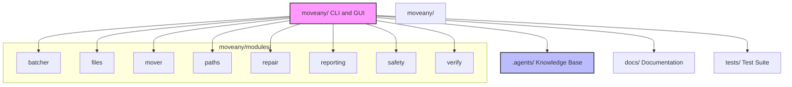
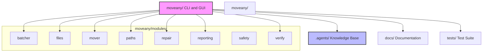
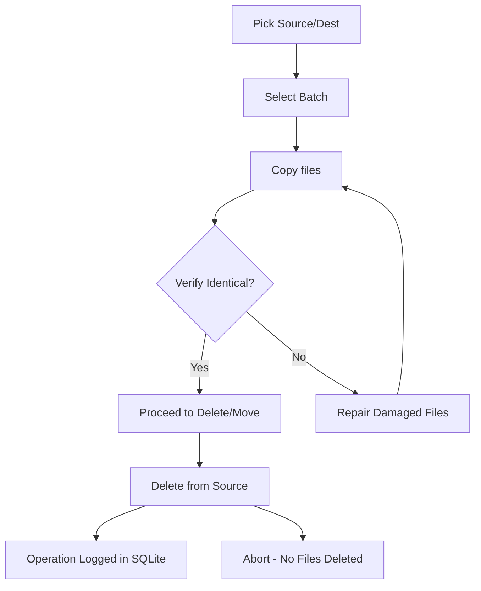
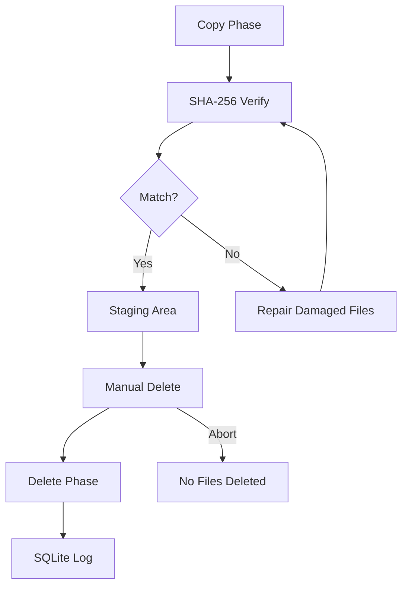

# MoveAny

**Safely relocate folders with files over Windows `MAX_PATH` limits — or any files, any platform.**

[User Guide](docs/user-guide.md) | [Developer Guide](docs/developer-guide.md) | [API Reference](docs/api-reference.md)

---



MoveAny is a cross-platform Python CLI (and desktop GUI) for **moving directories safely** with full



verification, staged deletion, and SQLite operation history. No file is deleted until it has been
independently verified at the destination.

---

MoveAny is a cross-platform Python CLI (and desktop GUI) for **moving directories safely** with full


verification, staged deletion, and SQLite operation history. No file is deleted until it has been
independently verified at the destination.

## Features

- **Staged copy** - Copy files to a staging area first, SHA-256-verify before any deletion
- **Manual delete only** - `delete` and `move` require `--yes` confirmation and re-verify each file
- **Full audit log** - Per-operation logs + SQLite history (queryable with `moveany history`)
- **Cross-platform** - Works on Windows, macOS, and Linux
- **GUI interface** - Tkinter-based desktop application with real-time log output
- **Exclusion management** - Configurable directory names to exclude from operations
- **Dry-run mode** - See what would happen without making any changes

## Installation

### Via pip (recommended)

```bash
# Basic install (CLI only)
pip install -e .

# With development dependencies (pytest + ruff)
pip install -e ".[dev]"
```

### Without installing

```bash
python -m moveany --help
```

### Requirements

- **Python 3.10+**
- **Tkinter** for the GUI (standard on Windows and macOS; on Linux install `python3-tk`)

## Quick Start

```bash
# Preview what would be copied (no changes)
moveany list-batches --source D:\Projects --dest E:\Backup

# Copy missing/different files (never deletes anything)
moveany copy --source D:\Projects --dest E:\Backup

# Verify both trees are content-identical
moveany verify --source D:\Projects --dest E:\Backup

# Full move workflow (copy + delete with confirmation)
moveany move --source D:\Projects --dest E:\Backup --yes

# Dry-run any command
moveany copy --source D:\Projects --dest E:\Backup --dry-run
```

## GUI

Launch the graphical user interface:

```bash
moveany gui
```

The GUI walks you through the same staged workflow (Pick → Batch → Copy → Verify → Repair → Move →
Delete) with real-time log output and confirmation dialogs before any destructive action.



## Safety Model

| Guarantee | How |
| :--- | :--- |
| **Copy first** | The copy phase is non-destructive and never deletes. |
| **Staged deletion** | Every file is copied and SHA-256-verified before the source is removed. |
| **Manual delete only** | `delete` and `move` require `--yes` and re-verify each file just before deletion. |
| **Abort on mismatch** | Delete phase refuses to run if any source file is missing or differs. |



| **Full audit log** | Per-category log files + SQLite operation history (queryable with `moveany history`). |

## Exclusions

Default exclusions include build artifacts like `node_modules`, `_build`, and `releases`. `.git` is
intentionally **not** excluded — repository history must be copied.

```bash
moveany exclude list                  # show effective exclusion set
moveany exclude add dist              # persist an addition
moveany exclude remove node_modules   # persist a removal
moveany exclude reset                 # reset to defaults
```

## Commands

| Command | Description |
| :--- | :--- |
| `moveany copy` | Scan + copy missing/different files to dest (non-destructive) |
| `moveany move` | Scan, copy, then delete from source in one workflow |
| `moveany verify` | Scan + compare contents; report a pass/fail verdict |
| `moveany repair` | Re-copy missing/damaged files from source to dest |
| `moveany delete` | Manual-only delete phase; re-verifies every file |
| `moveany list-batches` | Preview the batched plan without executing anything |
| `moveany exclude` | Manage exclusion directory names (add / remove / list / reset) |
| `moveany history` | Show recent operations from the SQLite log |
| `moveany config` | Inspect and manage persistent configuration |

## Development

```bash
# Run tests
python -m pytest tests/ -v

# Lint
ruff check moveany/ tests/
```

See the [Developer Guide](docs/developer-guide.md) for more details on the engine modules,
CLI architecture, and testing.

## Project Layout

```bash
moveany/
  cli.py                  # CLI entry point (orchestration only)
  config.py               # CLI-level config
  gui.py                  # Tkinter GUI application
  cfg/                    # Config submodules (exclusions, state, SQLite storage)
  modules/                # Engine modules — reusable by the GUI
    batcher.py
    files.py
    mover.py
    paths.py
    repair.py
    reporting.py
    safety.py
    verify.py
  __main__.py             # Enables `python -m moveany`

tests/
  test_safety.py
  test_batcher.py
  test_paths.py
  test_cli.py
```

The engine logic in `modules/` is deliberately decoupled from the CLI, using plain
`source`/`dest` parameters so the GUI can import it directly without any CLI dependency.

---

*Generated documentation: [User Guide](docs/user-guide.md), [Developer Guide](docs/developer-guide.md),
[API Reference](docs/api-reference.md)*