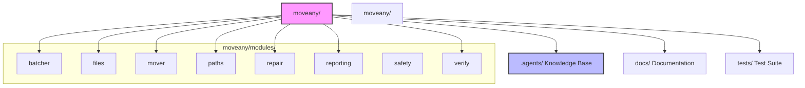

# MoveAny Developer Guide

## Project Structure



## Engine Modules

All engine logic lives in `modules/` only, decoupled from the CLI. Each module provides plain
`source`/`dest` parameters so the future GUI can reuse them directly.

### Key Modules

- **`batcher.py`** - Splits source tree into per-project batches
- **`files.py`** - Copy, SHA-256 compare, size verify
- **`mover.py`** - Copy + delete orchestration
- **`paths.py`** - Path normalization, UNC, symlink resolution
- **`repair.py`** - Re-copy missing/damaged files
- **`reporting.py`** - Structured log reporter
- **`safety.py`** - Staged deletion with copy-before-delete guarantee
- **`verify.py`** - Content comparison engine

### Importing Engine Functions

```python
from moveany.modules import batcher, mover, paths, repair as repair_mod
from moveany.modules.files import files_identical
from moveany.modules.reporting import Reporter
```

## CLI Architecture

The CLI in `cli.py` is **orchestration only** — no move logic lives here. It imports engine modules
from `moveany.modules` and calls them in order. This decoupling allows the future GUI to reuse the
same engine functions without CLI dependencies.

### CLI Commands

- `copy` - Scan + copy missing/different files to dest (non-destructive)
- `move` - Scan, copy, then delete from source
- `verify` - Scan + compare contents; report verdict
- `repair` - Re-copy damaged files from source to dest
- `delete` - Manual-only delete phase (re-verifies each file)
- `list-batches` - Show the batched copy/move plan without executing
- `exclude` - Manage exclusion directory names (add/remove/list)
- `history` - Show recent operations from the SQLite log (--json for JSON)
- `config` - Inspect and manage persistent configuration (show / reset)
- `gui` - Launch the Tkinter graphical user interface

## Testing

### Run Tests

```bash
python -m pytest tests/ -v
```

### Lint

```bash
ruff check moveany/ tests/
```

### Test Coverage

Tests cover:
- Safety/staged-deletion
- Batcher determinism
- Path normalization
- Full CLI integration (copy → verify → repair → delete cycle) using `click.testing.CliRunner`
on disposable temporary directories

## Development Setup

1. **Fork and clone** the repository
2. **Install dependencies**:

   ```bash
   pip install -e ".[dev]"
   ```

3. **Run the test suite**:

   ```bash
   python -m pytest tests/ -v
   ```

4. **Check linting**:

   ```bash
   ruff check moveany/ tests/
   ```

5. **Make your changes** and ensure all tests pass

### Adding New Features

1. Add engine logic to `modules/` if it's reusable
2. Add CLI command to `cli.py` if it's CLI-specific
3. Add GUI code to `gui.py` if it's GUI-specific
4. Add tests to `tests/`
5. Update documentation as needed

## Project Conventions

- Engine logic lives in `modules/` only, decoupled from the CLI
- Import engine functions as `from modules.{module} import {function}`
- Log everything using the Reporter and SQLite operation history
- Follow `.agents/templates/` for bugs, plans, agents, skills
- Do not add code comments unless they aid correctness; keep code clean