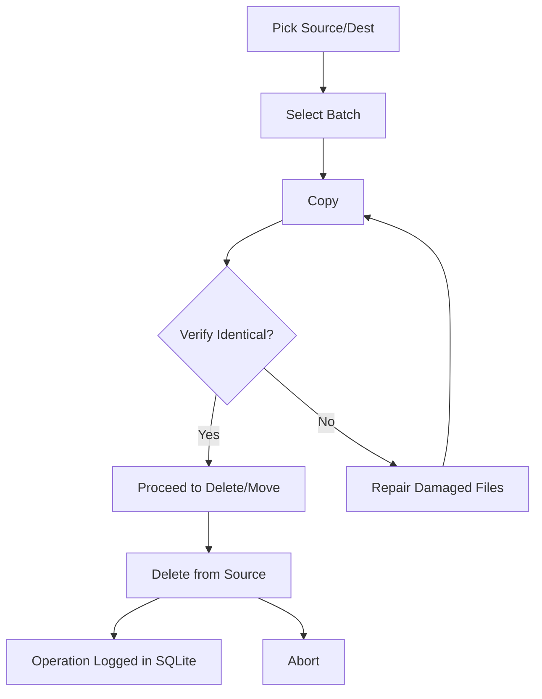
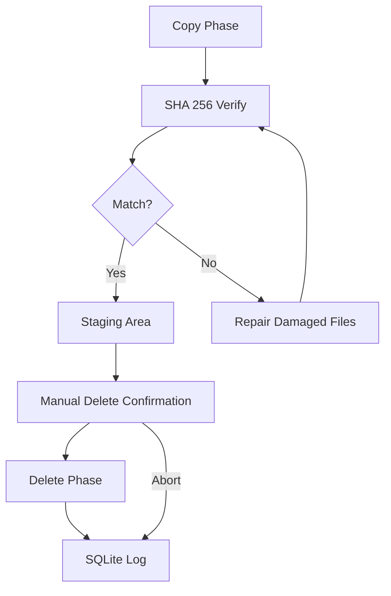

# MoveAny User Guide

## Introduction

MoveAny is a cross-platform Python command-line tool (with a Tkinter GUI) for safely relocating
folders and files that exceed Windows path-length limits (`MAX_PATH`), or any files on any platform.
It ensures no data loss by performing full verification before any destructive operations.

## Installation

### Via pip (recommended)

```bash
# Basic install (CLI only)
pip install -e .

# With development dependencies (pytest, ruff)
pip install -e ".[dev]"
```

### Without installing

```bash
python -m moveany --help
```

### Requirements

- **Python 3.10+**
- **Tkinter** for the GUI (standard on Windows and macOS; on Linux: `sudo apt install python3-tk`)

## Getting Started

### Basic Workflow

MoveAny uses a **staged workflow** to ensure safety:



1. **Pick** source and destination directories
2. **Select** a batch operation
3. **Copy** missing/different files (non-destructive)
4. **Verify** both trees are content-identical
5. **Repair** any damaged files
6. **Move** (copy + delete) or **Delete** files manually

### Common Commands

| Command | Description |
| :--- | :--- |
| `moveany copy` | Scan source and copy missing/different files to dest (non-destructive) |
| `moveany move` | Scan, copy missing/different, then delete from source |
| `moveany verify` | Scan both trees and compare contents; report verdict |
| `moveany repair` | Re-copy damaged files from source to dest |
| `moveany delete` | Manual-only delete phase (re-verifies each file) |
| `moveany list-batches` | Show the batched copy/move plan without executing |
| `moveany exclude` | Manage exclusion directory names |
| `moveany history` | Show recent operations from the SQLite log |
| `moveany config` | Inspect and manage persistent configuration |

## Usage Examples

### Copy Files Without Deleting

```bash
# Preview what would be copied (no changes)
moveany list-batches --source D:\Projects --dest E:\Backup

# Copy missing/different files (never deletes anything)
moveany copy --source D:\Projects --dest E:\Backup
```

### Verify & Repair

```bash
# Verify both trees are content-identical
moveany verify --source D:\Projects --dest E:\Backup

# Re-copy missing or damaged files after an interrupted copy
moveany repair --source D:\Projects --dest E:\Backup
```

### Full Move Workflow

```bash
# Move files from source to dest (copy + delete with --yes confirmation)
moveany move --source D:\Projects --dest E:\Backup --yes
```

### Dry-Run Mode

See what would happen without making any changes:

```bash
moveany copy --source D:\Projects --dest E:\Backup --dry-run
```

### Exclusion Management

```bash
# Show effective exclusion set
moveany exclude list

# Show all known build artifacts
moveany exclude list --available

# Add a new exclusion
moveany exclude add dist

# Remove an exclusion
moveany exclude remove node_modules

# Reset to defaults
moveany exclude reset
```

### GUI Interface

```bash
# Launch the graphical user interface
moveany gui
```

The GUI walks you through the same staged workflow (Pick → Batch → Copy → Verify → Repair → Move →
Delete) with real-time log output and confirmation dialogs before any destructive action.

## Safety Model



MoveAny guarantees the following:

| Guarantee | How |
| :--- | :--- |
| **Copy first** | The copy phase is non-destructive and never deletes. |
| **Staged deletion** | Every file is copied to a staging area and SHA-256-verified before the source is removed. |
| **Manual delete only** | `delete` and `move` require `--yes` and re-verify each file just before deletion. |
| **Abort on mismatch** | Delete phase refuses to run if any source file is missing or differs from the destination. |
| **Full audit log** | Per-category log files + SQLite operation history (queryable with `moveany history`). |

## Configuration

```bash
# Show current effective config as JSON
moveany config show

# Reset all exclusion overrides to defaults
moveany config reset --yes
```